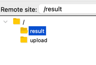

# SpecFlow Sample Project

This is a sample project to demonstrate how to use SpecFlow 

Sample Project is simple file downloader from SFTP. 
Then it will process file and upload ACK file to SFTP.

## How to run

Create temp folder in `/tmp`

    ```bash
    mkdir /tmp/specflow
    chmod -R 777 /tmp/specflow

    # create folders for docker sftp 
    # upload - upload folder; result - ack file folder ; archive - archive folder (not in use)
    mkdir specflow/docker/upload specflow/docker/result specflow/docker/archive

    # create folders for project
    mkdir specflow/local
    mkdir specflow/local/result specflow/local/download

    # create folder for integration test
    mkdir specflow/itest
    ```

Run docker compose

    Install Docker Desktop from https://www.docker.com/products/docker-desktop

    ```
    # goto docker folder under project and execute below command
    docker-compose -f docker.yml up

Upload file to SFTP

    Use Filezilla to connect to dockerized SFTP server.
    Docker SFTP login: u/p => `specflow:pass` Port: 2222 Host: localhost

Upload test file from one of the Test Resources folder under TestProject. 

Open Rider IDE and run `SpecFlowProject1` project. It will trigger file download from SFTP and process file. You can see file ACK file in `result` folder.

## How to run integration test

1. Run Project (project has not been dockerized yet)
   Get Endpoints: 
   a. localhost:5001 -> health check
   b. localhost:5001/download -> file download

2. Once above steps are done, you can run integration test

    Goto `Tests` folder and Right click on Test Project `SpecFlowSampleIntegrationTest ` and `Run Unit tests`


## About Specflow

SpecFlow is a tool that supports Behavior-Driven Development (BDD) by connecting business-readable behavior specifications to the underlying code. It is a .NET open source project that is available on GitHub and NuGet.

It separates the test code from the business code. It is easy to understand and maintain.

Test Scenarios as written under Feature File. It is glued to StepDefinitions by specflow framework.

# Docker

Use docker.yml file to run all dockerized component necessary for the project.

Currently, project has only SFTP dependency.

Use Filezilla to connect to dockerized SFTP server.
Docker SFTP login: u/p => `specflow:pass` Port: 2222 Host: localhost


Once login, you can see below two folders ready for use.

